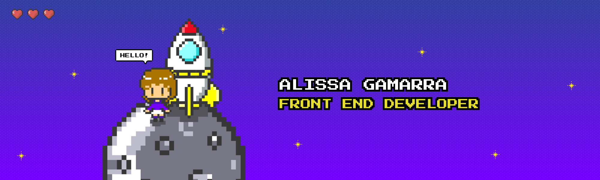

<h1 align="center">Full Stack Developer | Front End 👩‍💻 | UX UI Designer 👩‍🎨 | JavaScript | ES6 | ⚛️ React | Redux | HTML | CSS | NodeJS | Express | SQL 🚀</h1>

## [ENG] Who I am? 👩‍🚀
Hi there! I’m a **Full Stack Developer** oriented to **Front End**, **UX UI Designer**, graduated in Communications and a bachelor's degree in Advertising. 

Why the transition to Front End Development? My inclination in engaging both the analytical and creative hemispheres of my brain; and, in that sense, Front End Development + UX | UI Design ended up being the ideal combination for me. 

## [SPA] ¿Quién soy? 👩‍🚀
¡Hola! Soy una **Full Stack Developer** orientada al **Front End**, **UX UI Designer**, graduada en Comunicaciones y Licenciada en Publicidad.

¿Por qué la transición al Desarrollo Front End? Mi inclinación en involucrar tanto el hemisferio analítico como el creativo de mi cerebro; y, en ese sentido, Desarrollo Front End + UX | UI Design terminó siendo la combinación ideal para mí.

## [ENG] What I do? 👩‍💻
Currently, I am fully committed to engaging in projects that will aid me in my journey as a programmer; and, in addition, it will enhance my skills and knowledge as a developer.

## [SPA] ¿Qué hago? 👩‍💻
Actualmente, estoy totalmente comprometida a participar en proyectos que me ayudarán en mi viaje como programadora; y, además, potenciará mis habilidades y conocimientos como desarrolladora.

## [ENG] Where I am heading to? 🚀
My ambition is to become increasingly involved in the technology industry, participate in multiple projects, and consistently apply a level of comprehension, empathy, logic and precision that is crucial for creating functional and intuitive user experiences.

## [SPA] ¿Hacia dónde me dirijo? 🚀
Mi ambición es involucrarme cada vez más en la industria de la tecnología, participar en múltiples proyectos y aplicar constantemente un nivel de comprensión, empatía, lógica y precisión que es crucial para crear experiencias de usuarios funcionales e intuitivas.

<h2 align="left" id="macropower-tech">Favourite Tech 🦾</h2>

> Languages, tools and other platforms that I work with:
<table align="center">
  <tr>
    <td align="center" width="100">
      
       JavaScript
    </td>
    <td align="center" width="100">
      
       ES6
    </td>
    <td align="center"  width="100">
      
       React
    </td>
    <td align="center"  width="100">
      
       Redux
    </td>
    <td align="center" width="100">
      
       Node.js
    </td>
    <td align="center" width="100">
      
       Express
    </td>
  </tr>
  
  <tr>
    <td align="center" width="100">
      
       PostgreSQL
    </td>
    <td align="center" width="100">
      
       HTML5
    </td>
    <td align="center" width="100">
      
       CSS3
    </td>
    <td align="center" width="100">
      
       Sass
    </td>
    <td align="center" width="100">
      
       Less
    </td>
    <td align="center" width="100">
      
       Bootstrap
    </td>
  </tr>

  <tr>
    <td align="center" width="100">
      
       Git
    </td>
    <td align="center" width="100">
      
       GitHub
    </td>
    <td align="center" width="100">
      
       Illustrator
    </td>
    <td align="center" width="100">
      
       Photoshop
    </td>
    <td align="center" width="100">
      
       Figma
    </td>
    <td align="center" width="100">
      
       Blender
    </td>
  </tr>
</table>

## [ENG] Let's Connect! | [SPA] ¡Conectemos! 🤝

